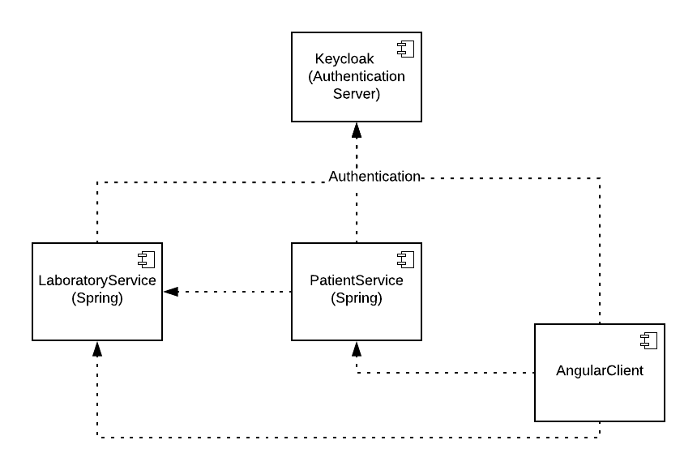

# Security Example

## Overview

### Services

The example consists of the following services
- Laboratory-Service (Port:8080): REST-Service, verwaltet Ressource LaboratoryResult
- Patient-Service (Port: 8081):  REST-Service, verwaltet Ressource Patient
- Keycloak (Port: 8180): Authentication and Identity Managment
- Angular-Client (Port: 4200): Presentation of Laboratory Results and Patients



### Roles and Permissions

Permissions/Roles | ROLE_DOCTOR | ROLE_ASSISTENT | ROLE_SECRETARY
-| - | - | -
**Read Laboratory Results** | X | X | 
**Read Extended Laboratory Results** | X |  | 
**Read Patient** | X | X | X
**Read Sensitiv data** | X |  | 

## Keycloak

Features of Keycloak:
- Identity Managment
  - Registration
  - Manage User Profile
  - Forgot Password
  - Password Policies  
- Authentication
  - Use different identity providers
  - Social Login 
- Authorization


In this example, Keycloak is used both as an identity management system and as an authentication service. To install Keycloak, see [Keycloak Server Installation](https://www.keycloak.org/docs/latest/server_installation/index.html). 

Why keycloak:
- Easy setup
- Easy to integrate existing identity provider
- Additional layer between identity provider and services (Individual customization of permission per customer)
- The permissions of the services can be configured individually (using different clients).
  -  Single service need not know the permissions in other services
  -  It is possible to grant developer the right to create permissions for specific services
- Adapter for different languages

### Keycloak in the example

In this example, the users and roles were created in Keycloak. It is also possible to use LDAP, Active Directory or your own [provider](https://www.keycloak.org/docs/4.5/server_development/#_providers). The following users are available in the example
- doctor1, password, ROLE_DOCTOR
- assistent1, password, ROLE_ASSISTENT
- secretary1, password, ROLE_SECRETARY

A separate client has been created in Keycloak for each service. To manage the rights of the example, the rights were defined as client-specific roles (e.g. the right "READ_LABORATORY_RESULT" was defined as a role in the client "laboratory-service"). These rights are inherited from the global roles (e.g. users with the role "ROLE_DOCTOR" also have the right "READ_LABORATORY_RESULT").

## Spring Rest Services

To avoid having to configure the security in both Spring services, the configuration has been transferred to a "Security Library" project, which is used as a dependency in the Spring services.

### Authentication

For authentication of Spring application with Keycloak there is an official adapter (Attention there is an own library for Spring Boot v2).
Example Configuration:

```
keycloak.auth-server-url=http://localhost:8180/auth/
keycloak.realm=stiwa
keycloak.resource=patient-service
keycloak.ssl-required = external
keycloak.principal-attribute=preferred_username
keycloak.credentials.secret=f9aba92d-fc2e-48d9-9432-a2e7891d985b
keycloak.use-resource-role-mappings=true #important to retrieve client-roles
```
````java
@Configuration
@EnableWebSecurity
@ComponentScan(basePackageClasses = KeycloakSecurityComponents.class)
public class KeycloakConfig extends KeycloakWebSecurityConfigurerAdapter {
	
	@Autowired
    public KeycloakClientRequestFactory keycloakClientRequestFactory;
	
    @Autowired
    public void configureGlobal(AuthenticationManagerBuilder auth) throws Exception {
    	
    	SimpleAuthorityMapper grantedAuthorityMapper = new SimpleAuthorityMapper();
		grantedAuthorityMapper.setPrefix("");
		grantedAuthorityMapper.setConvertToUpperCase(true);
    	
        KeycloakAuthenticationProvider keycloakAuthenticationProvider = new CustomKeycloakAuthenticationProvider();//keycloakAuthenticationProvider();
        keycloakAuthenticationProvider.setGrantedAuthoritiesMapper(grantedAuthorityMapper);
        
        auth.authenticationProvider(keycloakAuthenticationProvider);
    }
    
    @Bean
    @Scope(value = ConfigurableBeanFactory.SCOPE_PROTOTYPE)
    public KeycloakRestTemplate keycloakRestTemplate() {
        return new KeycloakRestTemplate(keycloakClientRequestFactory);
    }

    @Bean
    public KeycloakSpringBootConfigResolver KeycloakConfigResolver() {
        return new KeycloakSpringBootConfigResolver();
    }

    @Bean
    @Override
    protected SessionAuthenticationStrategy sessionAuthenticationStrategy() {
    	return new NullAuthenticatedSessionStrategy(); //stateless
    }

    @Override
    protected void configure(HttpSecurity http) throws Exception {
        super.configure(http);
        http
        	.cors()
        	.and().
        	authorizeRequests().anyRequest().permitAll();
    }
 }
 ````

### Method-Level-Security

 ````java
 public interface LaboratoryResultService {	
	@PreAuthorize("hasAuthority('READ_LABORATORY_RESULT')")
	Collection<LaboratoryResult> getAllResults(Long patientSvnr);
	
	@PreAuthorize("hasAuthority('READ_LABORATORY_RESULT')")
	LaboratoryResult getResult(Long id);
}
  ````

### Field-Level-Security

````java
@SecuredEntityViewPolicy(value = "PatientViewPolicy")
public class Patient {
	
	private String firstName;
	private String lastName;
	
	private String tel;
	private Long svnr;
	private String address;
	
	@JsonView(Views.Detail.class)
	private String bloodGroup;
	private String gender;
}
````
````java
@Component
public class CustomJsonViewCalculator extends JsonViewCalculator{
	@Override
	protected Class<?> getJsonView(String viewPolicy, Object responseValue, Authentication auth) {
		switch(viewPolicy) {
			case "PatientViewPolicy":
				if(AuthorityChecker.hasAuthority(auth, "SEE_SENSITIV_DATA")) {
					return Views.Detail.class;
				}
				return Views.Simple.class;
		}
		return null;	
	}
}
````

### Inter-Service-Communication

#### Feign Configuration

````java
@Configuration //Apply this configuration to all feign clients
public class KeycloakFeignConfiguration{
	
	public static final String AUTHORIZATION_HEADER = "Authorization";
	
	@Bean
	public RequestInterceptor keycloakInterceptor() {
		return new RequestInterceptor() {

			@Override
			public void apply(RequestTemplate template) {
				KeycloakSecurityContext context = getKeycloakSecurityContext();
				if(context!=null) {
					template.header(AUTHORIZATION_HEADER, "Bearer " + context.getTokenString());
				}
			}
			
		};
	}
}
````

#### Rest Template Configuration with Ribbon

````java
@Autowired
private KeycloakRestTemplate template;

private Object[] getLaboratoryResultsOfPatient(Long svnr) {
	UriComponentsBuilder builder = UriComponentsBuilder.fromHttpUrl("http://localhost:8080/api/laboratory-results").queryParam("patientsvnr", svnr);
	ResponseEntity<Object[]> response = template.getForEntity(builder.toUriString(), Object[].class);
	return response.getBody();
	}
````

````java
@Bean
@Scope(value = ConfigurableBeanFactory.SCOPE_PROTOTYPE)
public RestTemplate keycloakRestTemplate(KeycloakClientRequestFactory keycloakClientRequestFactory, LoadBalancerInterceptor interceptor) {
	KeycloakRestTemplate result = new KeycloakRestTemplate(
			keycloakClientRequestFactory);
		// Add the interceptor for load balancing
		result.getInterceptors().add(interceptor);
		return result;
}
````

## Angular Client

There is a separate adapter for Java Script applications, which is also used in the example application. Example Configuration:
````typescript
@Injectable()
export class AuthService {
  static auth: any = {};

  init(): Promise<any> {
    return new Promise((resolve, reject) => {
      const keycloakAuth = Keycloak('assets/keycloak/keycloak.json');
      console.log(keycloakAuth);
      keycloakAuth.init({ checkLoginIframe: false, onLoad: 'check-sso' }) //login-required {onLoad: 'check-sso'}
        .then(() => {
          AuthService.auth.loggedIn = keycloakAuth.authenticated;
          AuthService.auth.keycloak = keycloakAuth;
          AuthService.auth.logoutUrl = keycloakAuth.authServerUrl
            + '/realms/stiwa/protocol/openid-connect/logout?redirect_uri='
            + document.baseURI;
          resolve();
        })
        .catch(() => {
          reject();
        });
    });
  }

  getToken(): Promise<string> {
    return new Promise<string>((resolve, reject) => {
      if (AuthService.auth.keycloak.token) {
        AuthService.auth.keycloak
          .updateToken(5) //5 minites validity
          .success((refreshed) => {
            console.log('refreshed ' + refreshed);
            resolve(<string>AuthService.auth.keycloak.token);
          })
          .error(() => {
            reject('Failed to refresh token');
          });
      } else {
        AuthService.auth.keycloak.login();
        reject('Not logged in');
      }
    });
  }
}
````
## Setup Sample Application
1. Start a standalone version of keycloak
   1. Configure keycloak to run on port 8180 (/standalone/configuration/standalone.xml --> socket.binding.port=8180)
   2. Import realm from keycloak-folder
2. Run laboratory-service with mvn spring-boot:run
3. Run patient-service with mvn spring-boot:run
4. Run angular-client
   1. Install node
   2. run npm install
   3. run ng-serve --open


## Scenario 30.10.2018
1. Keycloak
   1.  What is a realm?
   2.  What is a client?
   3.  Show realm roles
   4.  Show users
   5.  Show client roles
   6.  Show composite roles
2. Spring Services
   1. Explain Security-Library
   2. Properties, Keycloak Config (Resource-role-mapping, AuthorityMapper, CustomKeycloakAuthenticationProvider)
   3. Method-Level-Security
      1. LaboratoryResultController + Authentication Point (HTTP-Security vs. MethodLevelSecurity)
   	  2. Show redirect in Browser (Secretary vs Doctor)
   3. Field-Level-Security 
      1. LaboratoryResultEntity, CustomJSONView Calculator
      2. Postman (Assistent vs Doctor)
   4. Show Service Communication (Doctor vs Secretary) 
   5. Show Logout and Authentication Endpoint
3. Angular Client
   1. AuthService: Start-Up vs. On-Demand
   2. AuthService: LoadUserProfile, HasRole
   3. Unauthorized: Open Patients -Redirect
   4. Secretary: No Results (Role check), Open Patients, Open Profile (configurable which user properties visible for client), Logout
   5. Assistent: Hiden fields, Add Permission to see hidden fields


## Todos

1. (Encrypting Database)
2. Keycloak API
3. Keycloak Flow
4. Keycloak Authorization
5. Webclient Authentication without Javascript Adapter
6. Service to Service authentication


